# 大文件分片上传

能上图不写字:



## 安装

> composer require roiwk/fileupload

## 需求

1. 浏览器支持fetch()

## 使用

前端:

```html
<input type="file" name="file" id="upload">
<button id="btn">Upload</button>

<script src="./upload.js"></script>

<script>
    window.onload = function () {
        var upload = new roiwkUpload({
            domain: "http://127.0.0.1"
        });
        document.querySelector("#btn").onclick = function(){
            upload.upload(document.querySelector("#upload").files[0]);
        };
    }
</script>
```

后端:

```php
// index.php
include_once 'path/to/vendor/autoload.php';

$app = new Roiwk\FileUpload\UploaderContainer();
echo $app->handle(true);

```

TODO: [文档](./doc)  文档还没写

## 开源许可协议

MIT 详见[LICENSE](./LICENSE)
